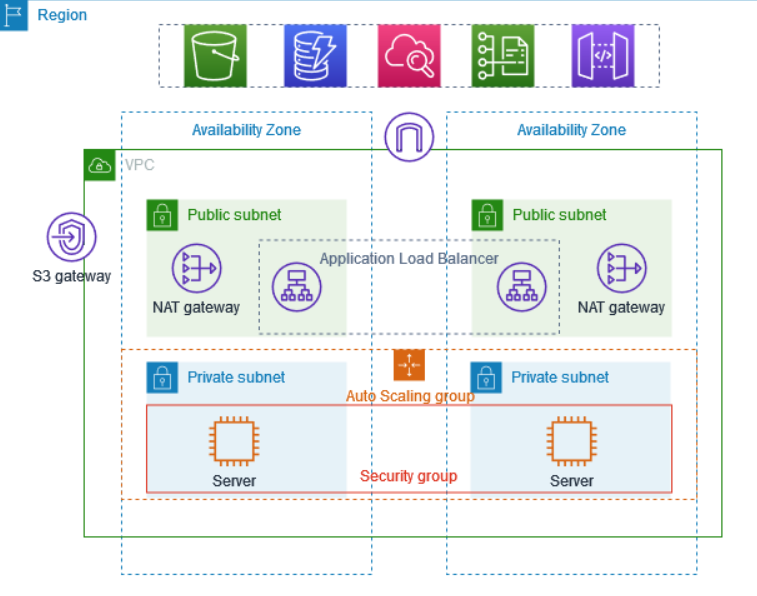

# Aws-vpc-multi-az-architecture
Welcome to my end-to-end AWS infrastructure deployment project. This repository documents the process of designing and deploying a **highly available, secure, and scalable application environment** using core AWS services within a custom-built VPC.

---

## 📌 Project Overview

This architecture is built with the goal of simulating a **production-grade environment** with real-world considerations for scalability, availability, and security.

### 🔧 Key Components:
- Custom VPC (IPv4)
- Public and Private Subnets (Multi-AZ)
- Internet Gateway (IGW)
- NAT Gateways (High Availability)
- S3 Gateway VPC Endpoint
- Application Load Balancer (ALB)
- EC2 Instances in Auto Scaling Group
- IAM Roles for secure access
- Security Groups for tight access control

---

## 📐 Architecture Diagram

---

## ⚙️ Architecture Breakdown

### 1. VPC & Subnets
- VPC with /16 CIDR block
- 2 Public subnets and 2 Private subnets across **2 Availability Zones**

### 2. Routing & Access Control
- **Internet Gateway** attached to VPC
- **NAT Gateways** in each public subnet
- Custom Route Tables for public/private traffic routing

### 3. Security
- Separate **Security Groups** for ALB and EC2
- IAM Role with permissions for EC2 to access S3
- **No direct internet access** to EC2 instances (private subnets only)

### 4. Compute & Load Balancing
- EC2 instances launched into private subnets via **Auto Scaling Group**
- **Application Load Balancer** manages incoming traffic and health checks
- ASG handles horizontal scaling based on CPU utilization

### 5. S3 Gateway Endpoint
- VPC Gateway Endpoint configured for secure and cost-effective S3 access from private subnets

---

## 🧠 What I Learned

- Designing resilient VPC architectures
- Real-time subnet planning across AZs
- Using NAT and Gateway Endpoints for secure outbound connectivity
- Hands-on configuration of ALB + Auto Scaling
- Practical use of IAM roles and best practices for security
- Troubleshooting AWS networking components

---

## 🛠️ Services Used

| AWS Service         | Purpose                                     |
|---------------------|---------------------------------------------|
| VPC                 | Isolated network setup                      |
| EC2                 | Compute instances in private subnets        |
| ALB                 | Distribute incoming traffic                 |
| Auto Scaling        | Automatically scale EC2 instances           |
| NAT Gateway         | Outbound internet access from private subnet|
| Internet Gateway    | Enable public subnet connectivity           |
| S3 Gateway Endpoint | Private S3 access without internet gateway  |
| IAM                 | Secure access to AWS resources              |

---

## 🚀 Future Improvements

- Add CI/CD using AWS CodePipeline + CodeDeploy
- Implement monitoring via CloudWatch dashboards
- Extend to multi-region for disaster recovery
- Infrastructure as Code (IaC) using Terraform or AWS CDK

---

## 🤝 Let's Connect

If you're working on AWS projects or just starting your cloud journey, feel free to reach out or connect!

📧 Email: divyanshnama.it26@gmail.com  
💼 LinkedIn: [Divyansh Nama](https://www.linkedin.com/in/divyansh-nama-39576b256/)  

---

## License

This project is open for learning and collaboration. Feel free to fork or contribute!

